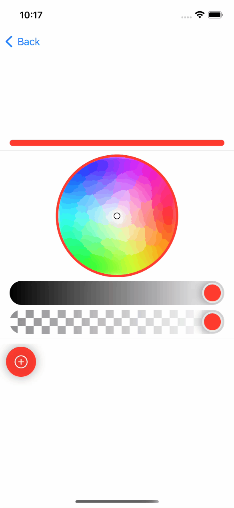

# SwiftUICustomViews

`SwiftUICustomViews` is a collection of my custom SwiftUI views.

## Description

### MyColorPicker

`MyColorPicker` is a color picker.
This has a color wheel, 2 sliders, and a pallet.

Users can pick hue with the color wheel and brightness and alpha with the sliders.
Users can store colors in the pallet.

## Requirement

iOS 13.0+

## Usage

## Install

## Contribution

1. Fork it ( https://github.com/HotariTobu/SwiftUICustomViews )
2. Create your feature branch (git checkout -b my-new-feature)
3. Commit your changes (git commit -am 'Add some feature')
4. Push to the branch (git push origin my-new-feature)
5. Create a new Pull Request

## License

[Unlicense](LICENSE)

## Author

[HotariTobu](https://github.com/HotariTobu)
